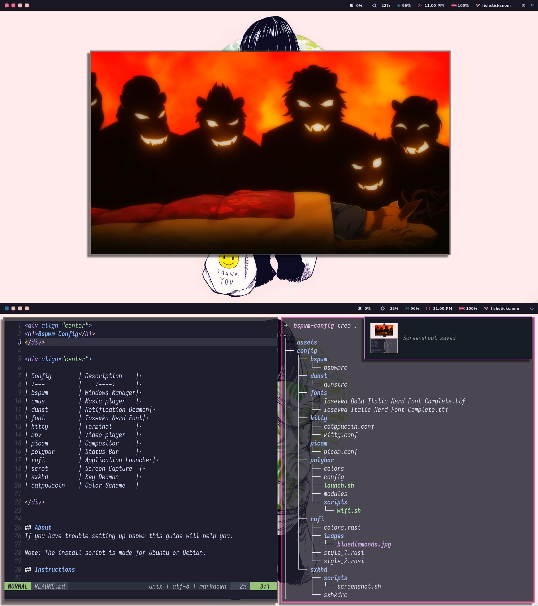

<div align="center">
<h1>Bspwm Config</h1>
</div>

<div align="center">

<br/>
</div>


<div align="center">

| Config        | Description         | 
| :---          |    :----:           | 
| bspwm         | Windows Manager     | 
| dunst         | Notification Deamon | 
| feh           | Wallpaper Manager   |
| font          | Iosevka Nerd Font   | 
| kitty         | Terminal            | 
| picom         | Compositor          | 
| polybar       | Status Bar          | 
| rofi          | Application Launcher| 
| scrot         | Screen Capture      | 
| sxhkd         | Key Deamon          | 
| catppuccin    | Color Scheme        |

</div>


## About
If you have trouble setting up bspwm this guide will help you.

Note: The install script is made for Ubuntu or Debian.

## Instructions

**Clone this repo**

```bash
git clone https://github.com/fishsticksnom/bspwm-config.git
```

```bash
cd bspwm-config
```


**Files permissions**


``` bash
chmod 644 config/sxhkd/sxhkdrc
chmod 755 config/bspwm/bspwmrc
chmod +x config/polybar/launch.sh
chmod +x config/polybar/scripts/wifi.sh
chmod +x config/sxhkd/scripts/screenshot.sh
chmod +x install.sh
./install.sh
````


**Copy directories**

All the directories need to be move into your /home/your_username_here/.config directory.

```bash
cp -r config/ ~/.config/
```

**Fonts**

```bash
mkdir ~/./local/share/fonts
cp -r fonts/ ~/.local/share/fonts/
fc-cache
```


**Wallpapers directory**

The wallpaper directory contains 3 images, the wallpaper, and 2 more images this images are use with dunst, everytime that bspwm or sxhkd configurations are reload an image will be display using dunst.

```bash
cp Wallpapers ~/Pictures/
```


## Config Files

Now you know where all the config files are, now is time customize them accordingly your preferences.


## Extra Keybindings

**Wifi Manager**

ALT + Shift + W


**Rofi**

ALT + D

**Screenshot**

ALT + Shift + P


<p align="center">If you find this repository helpful don't forget to give it a star and share!</p>


